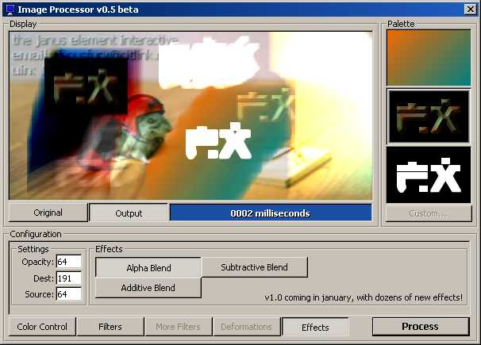



## PSC's Fastest Pure VB Graphics Manipulation \(v0\.5\)

### Description

Demonstrates using GetDIBits and StretchDIBits to manipulate images, and also shows fast ways to do alpha/additive/subtractive blending, and a variety of effects.
 
### More Info
 
Images

If you don't know what GDI is, you probably won't understand this code very well.

v1.0 will be available in january, or maybe on christmas if you guys give me a lot of votes :)

Cool looking images

Spending less time coding

Adding too many cool effects to your programs

             |
---                |---
**Submitted On**   |2001-12-13 18:29:58
**By**             |[Kevin Gadd](https://github.com/Planet-Source-Code/PSCIndex/blob/master/ByAuthor/kevin-gadd.md)
**Level**          |Intermediate
**User Rating**    |5.0 (35 globes from 7 users)
**Compatibility**  |VB 4\.0 \(32\-bit\), VB 5\.0, VB 6\.0
**Category**       |[Graphics](https://github.com/Planet-Source-Code/PSCIndex/blob/master/ByCategory/graphics__1-46.md)
**World**          |[Visual Basic](https://github.com/Planet-Source-Code/PSCIndex/blob/master/ByWorld/visual-basic.md)
**Archive File**   |[PSC's\_Fast4190112132001\.zip](https://github.com/Planet-Source-Code/kevin-gadd-psc-s-fastest-pure-vb-graphics-manipulation-v0-5__1-29762/archive/master.zip)

